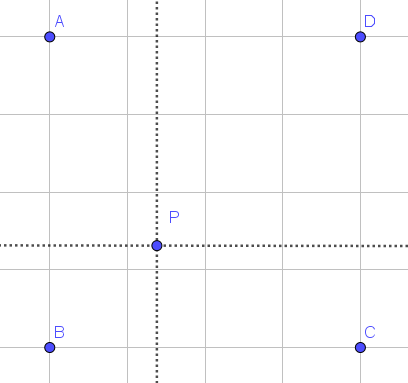
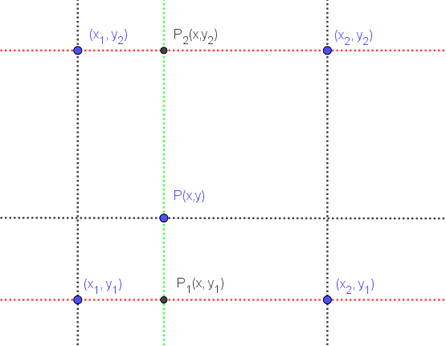

# 图像增强

## 项目背景

### 投影

设原图的长和宽分别为$height$、$width$，目标图像的长和宽分别为$out\_height$、$out\_width$，投影的计算式为

$$
\dfrac{h}{out\_h} = \dfrac{height}{out\_height}\\
\dfrac{w}{out\_w} = \dfrac{width}{out\_width}\\
$$

但如果直接这样投影，会导致目标图的中心与原图中心不能对齐，因为每个像素点是一个正方形，坐标为$(h,w)$的像素点的中心位置是$(h+0.5,w+0.5)$，所以投影的计算式应改为

$$
\dfrac{h+0.5}{out\_h} = \dfrac{height+0.5}{out\_height}\\
\dfrac{w+0.5}{out\_w} = \dfrac{width+0.5}{out\_width}\\
$$

### 图像增强

为了增强图片的视觉效果，根据图像的应用场合，增强图片中的有用信息。有目的地强调图像的整体或局部特性，将原来不清晰的图像变得清晰或强调某些感兴趣的特征，扩大图像中不同物体特征之间的差别，抑制不感兴趣的特征，使之改善图像质量、丰富信息量，加强图像判读和识别效果，满足某些特殊分析的需要。

### 图像插值技术

将图片放大时，需要根据低分辨率下的像素值推测出它周围的像素值

#### 分类

- 线性插值方法：采用同一种插值内核，不用考虑像素点所处的位置，因此这种插值方法会导致边缘模糊
  - 最邻近插值
  - 双线性插值
  - 双三次插值
- 非线性插值方法
  - 基于边缘信息
    - 边缘导向插值(NEDI)
    - 最小均方差估计插值(LMMSE)
    - 软判决自适应插值(SAI)
    - 边缘对比度引导的图像插值(CGI)
  - 基于小波系数

##### 线性插值

插值函数为一次多项式，在其插值节点的误差为0。利用连接两个已知量的直线来确定这两个已知量之间（或之外）的某一个未知量的值，如图


$$
y=y_1 + \dfrac{y_2-y_1}{x_2-x_1}(x-x_1),(x_1<x<x_2)
$$

<!------ waiting ------>

##### 最邻近插值

在二维图像中，像素点的坐标均为整数，最邻近插值是通过取整选取离目标最近的点。如图，P距离B最近，则f(P)=f(B)



**误差分析**

这种变换后得到的像素只由原来的一个像素点决定，实际上只是这个像素点影响较大而已，其余的3个像素点也会按照不同的权重产生一定的影响。

##### 双线性插值

双线性插值是线性插值的一个推广，在$x$方向上做了两次线性插值，然后在$y$方向上做了一次线性插值，如图



首先对$x$方向做插值运算得到$P_1,P_2$：

$$
f(x, y_1)=\dfrac{x_2-x}{x_2-x_1}f(x_1,y_1)+\dfrac{x-x_1}{x_2-x_1}f(x_2, y_1)\\
f(x, y_2)=\dfrac{x_2-x}{x_2-x_1}f(x_1,y_2)+\dfrac{x-x_1}{x_2-x_1}f(x_2, y_2)\\
$$

然后在$y$方向做插值运算得到$P$：

$$
f(x,y)=\dfrac{y_2-y}{y_2-y_1}f(x, y_1) + \dfrac{y-y_1}{y_2-y_1}f(x,y_2)
$$

综上，插值计算式为：

$$
f(x,y)=\dfrac{(y_2-y)(x_2-x)}{(y_2-y_1)(x_2-x_1)}f(x_1, y_1) + \dfrac{(y_2-y)(x-x_1)}{(y_2-y_1)(x_2-x_1)}f(x_2,y_1)
+\dfrac{(y-y_1)(x_2-x)}{(y_2-y_1)(x_2-x_1)}f(x_1,y_2) + \dfrac{(y-y_1)(x-x_1)}{(y_2-y_1)(x_2-x_1)}f(x_2,y_2)
$$

由于周围4个点是离$P$最近的像素点，所以$y_2-y_1=1$，$x_2-x_1=1$，则计算式可写为

$$
f(x,y)=(y_2-y)(x_2-x)f(x_1, y_1) + (y_2-y)(x-x_1)f(x_2,y_1)+(y-y_1)(x_2-x)f(x_1,y_2) + (y-y_1)(x-x_1)f(x_2,y_2)
$$

## 项目目标

利用最邻近插值和双线性插值对图像增强处理。

## 环境依赖

本项目采用python3.9.12解释器并且需要`numpy`第三方库及其依赖环境

```shell
pip install -r requirements.txt
```

## 项目结构

### 源代码结构

- **imgprocess.py**，结构如下图
  - `openImage`：打开图片，返回`PIL.PngImagePlugin.PngImageFile`
  - `saveImage`：根据矩阵生成图片，返回`PIL.PngImagePlugin.PngImageFile`


- **enhance.py**，结构如下图
  
  - `nearestInterpolation`：最邻近插值
  
  - `bilinearInterpolation`：双线性插值


- **main.py**：用于本项目测试

## 项目功能

通过命令行运行`main.py`，交互界面如下

## 安装与使用

### 安装教程

### 使用实例
